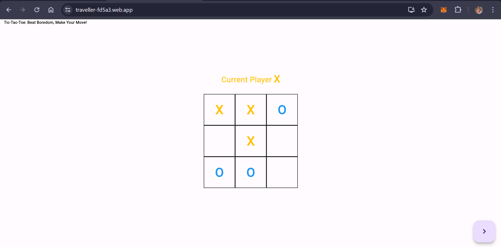

# Classroom Tic-Tac-Toe

Welcome to Classroom Tic-Tac-Toe, a creative and fun game designed to beat boredom during class breaks! 🎉

## Overview

Playing tic-tac-toe is a fantastic way to pass the time and keep yourself entertained during those seemingly endless class breaks. This project was born out of the desire to turn those moments of boredom into an engaging and enjoyable experience.

## Features

- **Instant Entertainment**: Quickly start a game to fill those short breaks between classes.
- **Sleek Design**: Enjoy a visually appealing and user-friendly interface.
- **Rules Reminder**: You know the Rules (hahahaa...😅).
- **Make Your Move**: Strategize and have fun making your moves on the virtual board.

## How to Play

1. **Click on the link:**   [start playing](https://traveller-fd5a3.web.app/)
    

2. **Enjoy!**
    Have fun beating boredom and mastering the classic game of tic-tac-toe!

## Contribution

Contributions are welcome! If you have ideas for improvements, new features, or find any issues, feel free to open an issue or submit a pull request.
